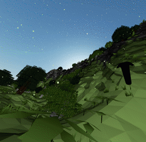

# Exokit

## Native VR and AR engine for JavaScript 🦖


[](https://join.slack.com/t/exokit/shared_invite/enQtNDI3NjcxNzYwMDIxLWU2NmFmOTEzMzk4NWNiYjRhMjVkYzcyNjg5YjUyMzZkYWM1ZGI4M2IwYWZiMjNlMTJjMDlkM2U3Y2JiNTc2M2Q)
[](https://github.com/webmixedreality/exokit/releases )
[](https://www.npmjs.com/package/exokit)
[](https://travis-ci.org/modulesio/exokit-windows)
[](https://ci.appveyor.com/project/modulesio/exokit-windows)
[](https://twitter.com/webmixedreality)

### Subscribe to our Email list to be notified when we launch! http://eepurl.com/dFiLMz

This project enables developers to build XR experiences using the same code that runs on the web. Exokit engine is written on top of Node and emulates a web browser, providing native hooks for WebGL, WebXR, WebAudio, and other APIs used in immersive experiences.

Exokit targets the following platforms:
* Desktop VR (Steam compatible)
* Mobile AR (ARKit / ARCore)
* Magic Leap
* Mobile VR (Daydream / Gear VR)

Since Exokit supports anything that runs on the web, it powers experiences built with:
* Three.js
* Unity
* Pixi.js
* Babylon.js
* A-Frame
* Custom WebGL frameworks
* WebAssembly, TypeScript, and any language that transpiles to JavaScript

# Quickstart

#### [Download for current OS](https://get.webmr.io)

#### Build your own (desktop)

```
git clone https://github.com/webmixedreality/exokit.git
cd exokit
npm install
node . # or node . -h for home
```

#### Run a WebXR site (desktop)

```
exokit https://emukit.webmr.io/ # start Emukit in Exokit
```

#### [Download for Magic Leap](https://get.webmr.io/magicleap)

#### Run (Magic Leap device)

```
mldb connect 192.168.0.10:1131 # mldb needs to be connected; see MLDB documentation
mldb install -u exokit.mpk # downloaded or built package
mldb launch com.webmr.exokit -v "ARGS=node . examples/hello_ml.html" # or URL to load
mldb log exokit:*
```

#### Debug (Magic Leap device)

```
"$MLSDK/tools/debug/debug.py" --deploy-mpk exokit.mpk build/magicleap/program-device/release_lumin_clang-3.8_aarch64/program-device --env "ARGS=node . examples/hello_ml.html" # or URL to load
```

## Manifesto



- The future is immersive. The web is the best application platform. Javascript is the best ecosystem.
- Content should be hardware agnostic. Tomorrow will have different hardware. VR and AR should be compatible.
- It's not possible to do both 2D and 3D well. We don't do 2D. We can use an external 2D browser.
- Use your favorite game engine. Exokit is not a game engine.
- Legacy browser design choices don't make sense in XR.
- Exokit empowers and connect apps, even (especially) if they aren't designed to cooperate.
- Apps should run in "reality tabs", layers of reality that blend together.

## Architecture

Exokit is a Javascript [Node.js](https://nodejs.org) module.

C++ bindings hook into WebGL, WebXR, Magic Leap, Leap Motion, and various other device APIs.

`const {window} = require('exokit')()` to get an immersive browser in another project.

Exokit runs on Windows, macOS, Linux (x64), Linux (ARM64), and Magic Leap (ARM64).

## Web API support

- HTTP/S
- HTML5
- `<script>`
- DOM
- WebGL
- WebXL
- Canvas2D
- WebSocket
- Web Workers
- ``, `<audio>`, `<video>`
- WebAudio
- Keyboard/Mouse events
- Gamepad API
- `<iframe>`
- **No** HTML layout
- **No** HTML rendering
- **No** CSS
- **No** Legacy APIs

## Hardware bindings

- OpenGL
- OpenVR (Steam VR)
- Magic Leap
- Leap Motion

## Why Exokit?

- You want your WebGL/WebXR to run fast.
- You want the hot new web APIs.
- You want to add your own integrations -- including native -- into a browser environment.
- You want a lightweight browser as a hackable node module.
- You want to combine the web with a 3D engine like Unity.

## Why not Exokit?

- You're looking for a "web browser".
- You don't care about 3D or mixed reality.
- You're looking for strict and/or legacy standards support.

## Debugging

Uses [ndb](https://github.com/GoogleChromeLabs/ndb).

```js
npm run debug
```

Then in the console, input:

```
let window = await require('./index').load(yourUrl);
```

Now you have a handle on the window object as you test your application, and
you can set `debugger` breakpoints and such.

## Keyboard


## Community

- [Slack](https://communityinviter.com/apps/exokit/exokit) for development
- [Discord](https://discord.gg/Apk6cZN) for hanging out
- [Twitter](https://twitter.com/webmixedreality) for silliness

## Contributors

- [Avaer K](//github.com/modulesio)
- [Nick L](//github.com/Fierent)
- [Chris Eddy](//github.com/ChrisEddy)
- [Chris La Torres](https://github.com/chrislatorres)
- [Noah A S](//github.com/NoahSchiffman)
